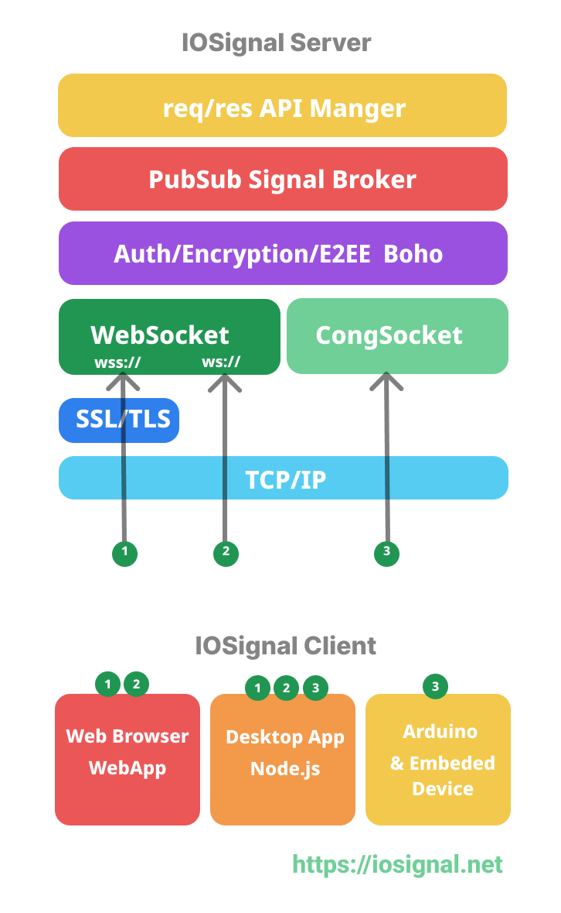

# IOSignal CLI 
[ 한국어 | [English](README.md) ]

IOSignal은 웹 브라우저, Node.js 애플리케이션 및 Arduino 장치 간의 실시간 통신을 용이하게 합니다. 또한 안전한 인증 및 암호화된 통신을 제공합니다. 내장된 시그널링 프로토콜을 통해 서버는 추가 프로그래밍 없이 사용할 수 있습니다.

`iosignal-cli` 프로그램은 IOSignal 서버 및 클라이언트의 작동을 단순화합니다. [iosignal](https://www.npmjs.com/package/iosignal) 라이브러리를 활용하고 인증 데이터베이스 기능에 Redis를 사용합니다.

## 지원 플랫폼

Windows, macOS, Linux.

## 설치

### Linux, macOS 및 쉘

```sh
# 전역 설치.
$ npm install -g iosignal-cli

# 권한 오류가 발생하면 sudo를 사용하십시오.
$ sudo npm install -g iosignal-cli
```

### Windows (관리자 권한)

```sh
# 전역 설치.
$ npm install -g iosignal-cli
```

## IOSignal 서버

- `io-server` 명령을 사용합니다.
- `ios`는 `io-server`의 약어입니다.

```
% io-server -h
Usage: io-server [options] (--listen <port> )

Options:
  -V, --version                      output the version number
  -l, --listen <port>                listen on port (start WebSocket Server)
  -L, --listen-congport <port>       listen on cong port (start CongSocket
                                     Server)
  -d, --auth-file <path>             auth data file path
  -e, --auth-param <id.key.level>    auth data from argument:
                                     id.key.level,id2.key2.level2
  -E, --auth-env                     auth data from shell env BOHO_AUTH
  -r, --auth-redis                   connect to redis. if exist use env
                                     REDIS_HOST, REDIS_PORT or localhost:6379
  -t, --timeout <milliseconds>       ping period & timeout
  -m, --metric <type>                show metric <number> 1:traffic, 2:echo
  -s, --show-message <none|message>  show receive message.
  -f, --file-logger                  write log files.
  -a, --api-list [list...]           one or multiple api names:  -a api_1 api_2
  -o, --show-options                 show server init options.
  -h, --help                         display help for command

```

### WebSocket을 통한 IOSignal

- `-l` 옵션을 사용하여 WebSocket 연결을 위한 포트 번호를 지정합니다.
- 웹 브라우저 및 Node.js 클라이언트 액세스를 지원합니다.

```sh
 % io-server -l 7777
```

### CongSocket을 통한 IOSignal

- `-L` 옵션을 사용하여 CongSocket 연결을 위한 포트 번호를 지정합니다.
- CongSocket은 WebSocket보다 가볍게 설계된 IOSignal의 자체 프로토콜입니다.
- Arduino와 같은 저사양 장치를 위해 특별히 개발되었습니다.
- Arduino 및 Node.js 클라이언트 액세스를 지원합니다.

```sh
 % io-server -L 8888
```

### WebSocket 및 CongSocket 동시 지원

- 이를 통해 Arduino와 웹 브라우저가 서로 통신할 수 있습니다.

```sh
% io-server -l 7777 -L 8888
opening WebSocket Server: 7777
opening CongSocket Server: 8888

   ┌───────────────────────────────────────────┐
   │                                           │
   │   Serving                                 │
   │                                           │
   │   IOSignal Over WebSocket                 │
   │                                           │
   │    Web Browser & Node.js                  │
   │    - Local:    ws://localhost:7777        │
   │    - Network:  ws://192.168.0.72:7777     │
   │                                           │
   │   IOSignal Over CongSocket                │
   │                                           │
   │    Node.js                                │
   │    - Local:    cong://localhost:8888      │
   │    - Network:  cong://192.168.0.72:8888   │
   │                                           │
   │    Arduino                                │
   │    - host: 192.168.0.72                   │
   │    - port: 8888                           │
   │                                           │
   └───────────────────────────────────────────┘


```

## 모니터 서버

### 수신 메시지 보기

- 서버에서 수신되는 시그널 메시지를 보려면 `-s` 옵션을 사용합니다.
- `ios`는 `io-server`의 약어입니다.

```
% ios -l 7777 -s message 
... 

#1(undefined) [ CID_REQ ] <Buffer c1>
#1(?ayTp) [ SIGNAL ] <Buffer d0 02 68 69 00>
#1(?ayTp) [ PING ] <Buffer cd>

```

### 메트릭 보기

- `-m 1`: 채널, 클라이언트 및 트래픽을 표시합니다.
- `-m 2`: 클라이언트를 표시합니다.
- `-m 3`: 채널을 표시합니다.

```sh

$ ios -l 7777 -m 1
...

monitor metric type: 1
┌─────────┬───────────┬───────────┬──────────┬──────────┬──────────────┐
│ (index) │    rss    │ heapTotal │ heapUsed │ external │ arrayBuffers │
├─────────┼───────────┼───────────┼──────────┼──────────┼──────────────┤
│    0    │ 108232704 │ 57294848  │ 24523112 │ 1389925  │    59260     │
└─────────┴───────────┴───────────┴──────────┴──────────┴──────────────┘
┌─────────┬──────────┬─────────┬──────────┬─────────┬─────────┐
│ (index) │ lastSSID │ remotes │ channels │ txBytes │ rxBytes │
├─────────┼──────────┼─────────┼──────────┼─────────┼─────────┤
│    0    │    2     │    2    │    1     │   57    │   18    │
└─────────┴──────────┴─────────┴──────────┴─────────┴─────────┘


$ ios -l 7777 -m 2
...
monitor metric type: 2
┌─────────┬───────────────┐
│ (index) │    Values     │
├─────────┼───────────────┤
│    0    │ '#1:?9P-i(7)' │
│    1    │ '#2:?zNuW(7)' │
└─────────┴───────────────┘


$ ios -l 7777 -m 3
...
monitor metric type: 3
┌─────────┬───────────────────────┐
│ (index) │        Values         │
├─────────┼───────────────────────┤
│    0    │ 'PRIVATE:#homeButton' │
└─────────┴───────────────────────┘
```

## IOSignal 클라이언트

- `io-client` 명령을 사용합니다.
- `io`는 `io-client`의 약어입니다.

### 사용법

```
 % io -h
Usage: io [options] (--connect <url> )

Options:
  -V, --version                     output the version number
  -t, --timeout <milliseconds>      ping period & timeout
  -c, --connect <url>               connect to a server
  -i, --id <id>                     userId
  -k, --key <key>                   userKey
  -a, --auth-idKey <idkey>          auth id.key
  -j, --join-channel <channelName>  join to channel
  -h, --help                         display help for command

```

### 연결

- 서버에 연결하려면 `-c` 옵션을 사용하여 서버 주소와 포트 번호를 지정합니다.
- 서버 주소는 다음 프로토콜 중 하나를 필요로 합니다: `ws`, `wss`, 또는 `cong`.
  - `ws://url:port` (WebSocket)
  - `localhost`의 경우 `ws://`는 생략할 수 있습니다.
  - `wss://url:port` (WebSocket TLS)
  - `cong://url:port` (CongSocket)

```sh
% io -c ws://localhost:7777
{ connect: 'ws://localhost:7777' }
Connecting to ws://localhost:7777
ready:  cid: ?cybL
> 

```

```sh
% io -c cong://localhost:8888
{ connect: 'cong://localhost:8888' }
Connecting to cong://localhost:8888
ready:  cid: ?yVAQ
> 

```

- 클라이언트 연결에 성공하면 `cid` (통신 ID)가 `ready` 표시와 함께 표시됩니다.
- CID는 서버에서 발급하는 고유한 통신 ID입니다.
- 인증되지 않은 클라이언트의 CID는 연결할 때마다 변경됩니다.
- 인증된 클라이언트는 고정된 사전 정의된 CID를 사용합니다.
- CID를 사용하여 일대일 통신 또는 CID 구독을 할 수 있습니다.

### `io-client` CLI 명령 목록

- `io-client` CLI 프로그램을 사용하여 서버에 연결하면 아래 명령을 사용하여 통신하고, 구독하고, 시그널을 발행할 수 있습니다.
- CLI 프로그램은 서버에 연결된 브라우저 및 Arduino 장치와도 통신할 수 있습니다.

```
io-client cli commands: 
 .sig
 .signal .publish .pub is the same as .sig.
 .sub 
 .subscribe is the same as .sub. 
 .listen : subscirbe and print the received messages to the screen.
 .unsub 
 .ping 
 .pong 
 .id 
 .iam 
 .open 
 .connect 
 .close 
 .login 
 .auth 
 .quit 
 .exit
```

## 튜토리얼

### 시그널링

- **멀티캐스트**: 채널 이름을 구독/발행합니다.
- **유니캐스트**: CID (통신 ID)를 사용합니다.

1. 서버 시작:
```sh
$ io-server -l 7777

```

2. 클라이언트 A 시작:

```sh
$ io -c localhost:7777
Connecting to ws://localhost:7777
ready:  cid: ?c3Nr 

> .subscribe channel_name  
# 채널 구독
```

3. 클라이언트 B 시작:
```sh
$ io -c localhost:7777
Connecting to ws://localhost:7777
ready:  cid: ?rr75
> 
# 멀티캐스트.
> .signal channel_name some_message   

# A에게 유니캐스트.
> .signal ?c3Nr@ direct_message  
# 중요: 유니캐스트 시그널 태그에는 '@' 문자가 포함되어야 합니다 (예: tag = 'cid' + @).
```

### 인증

#### 유형 1: 파일에서 인증 데이터

- 개인 용도로만 사용합니다.
- 원시, 일반 비밀번호 문자열 (해시되지 않음).
- 각 장치에는 `deviceId`, `deviceKey`, `deviceCId`, `level`의 네 가지 값이 있습니다.
- 루트 폴더에서 샘플 `auth_file.js` 및 `auth_file.json`을 찾을 수 있습니다.
```sh
$ io-server -l 7777 -d auth_file.json
   or
$ io-server -l 7777 -d auth_file.js
```

`auth_file.json` 구조:
- `deviceId` 문자열 길이 제한: 8자.
- 비밀번호 문자열 길이 제한 없음 (SHA256으로 32바이트로 다이제스트됨).
- `CID` 문자열 길이 제한: 현재 20자 (변경 가능).
- JSON 파일은 주석을 지원하지 않습니다.
```js
[
  ["id","key","cid",0],
  ["did2","did2key","did2-cid",0],
  ["uno3","uno3-key","uno3-cid",1]
]
```

### `auth_file.js`

- 주석을 지원합니다.

```js
// *.mjs file support comments.
export const authInfo = [
  // device id, key, communication id, level:Number(0~255)
  ["did","passowrd","cid",0],  
  ["device1","device1_key","device1_cid",0],
  ["root","root-key","root-cid",255],  // default admin_root level is 255
  ["uno","uno-key","uno",1]
]
```

#### 유형 2: Redis (또는 기타 데이터베이스)에서 인증 데이터

- 권장됩니다.
- 소스 코드 및 예제는 다음에서 찾을 수 있습니다:
  - `iosignal`: `/src/auth/`
  - `iosignal-cli`: `/test_auth_redis/`

서버를 실행하기 전에 Redis 서버가 작동 중이고 장치 자격 증명을 등록했는지 확인하십시오. 간단한 자격 증명 등록 예제는 위 소스에 포함되어 있습니다.

로컬 Redis 인증 시스템으로 서버 시작
```sh
$ io-server -l 7777 -r   # redis://localhost:6379
```

### 클라이언트 인증
1. 인증 서버를 시작합니다.
2. 연결하고 로그인합니다.

```sh
$ io -c localhost:7777
ready:  cid: ?YXDr
> .login uno3 uno3-key
try manual login:  uno3
> >> QUOTA_LEVEL :  1
current quota: {"signalSize":255,"publishCounter":10,"trafficRate":100000}
ready:  cid: uno3-cid
 
- 이제 장치에 (사전 등록된) CID가 있습니다.

```

## 웹 브라우저 및 Arduino 동시 지원

### 두 가지 유형의 포트 지정

IOSignal은 웹 브라우저 피어 연결에 WebSocket을 사용합니다. Arduino 연결을 사용하려면 `-L` 옵션을 사용하여 CongSocket 포트를 지정해야 합니다.

`-l` 옵션은 WebSocket 포트를 지정하고, `-L` 옵션은 Arduino 연결을 위한 CongSocket 포트를 지정합니다.

```sh

$ io-server -l 7777 -L 8888
# -l 옵션은 WebSocket 포트용
# -L 옵션은 CongSocket 포트용 (Arduino 연결)
```

### 로컬 네트워크 IP 주소

로컬 네트워크에서 서버에 액세스하기 위해 서버의 IP 주소가 필요한 경우 다음 명령을 사용하여 확인할 수 있습니다:

```sh
$ ioip
192.168.0.72
```

### IOSignal Arduino 라이브러리

Arduino 라이브러리 관리자에서 `IOSignal`을 검색하여 설치하거나, [`iosignal-arduino`](https://github.com/remocons/iosignal-arduino) GitHub 저장소를 참조하십시오.

## iosignal 스택
