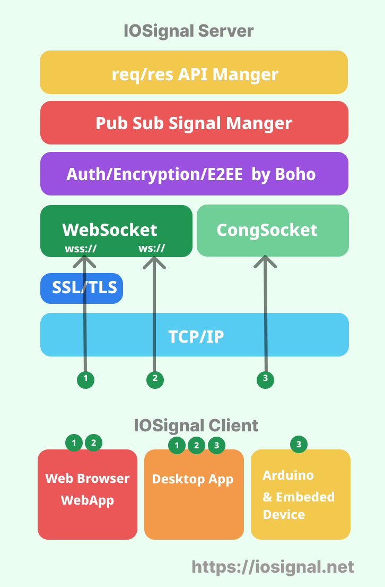

# IOSignal CLI

iosignal-cli program that makes it simple to run a iosignal server and client. It uses the [iosignal](https://www.npmjs.com/package/iosignal)  library and uses Redis for authentication database functionality.

## supports 
Windows, Mac, and Linux.

## install
Linux, Mac and shell
```sh
# global install.
$ npm install -g iosignal-cli

# If NO Permissioin error, use sudo prefix.
$ sudo npm install -g iosignal-cli
```
windows as admin permission
```sh
# global install.
$ npm install -g iosignal-cli
```


## IOSignal server

```sh
$ io-server
# start server with default option.
# default. open port 7777 with WebSocket. 


$ io-server -l 5555 
# you can specify listen port number

$ io-server -l 0 -L 5555
# use number 0 to disable WebSocket service.

```

## iosignal client


```sh
$ io # or io alias
# connect to localhost:7777 with websocket.

# use -c to define websocket url and port number.
$ io -c wss://websocket_server_url:port
$ io -c ws://localhost:7777

# support ws or wss(TLS).

```

## iosignal commands

- subscribe('tag')
- publish('tag', message ) 
- signal('tag', message )  // same with publish
- not ready whole document.

## tutorial 

### signaling 

- multi-cast: publish/subscribe channel_name
- uni-cast: use cid(communication id)

1. start server
```sh
$ io-server  # alias ios

```

2. start client A.

```sh
$ io
Connecting to ws://localhost:7777
ready:  cid: ?c3Nr 
# connected and receive client cid.
# CID(Communicaion Id of the io client.)

> .subscribe channel_name  
# subscribe some channel
```

3. start client B.
```sh
$ io
Connecting to ws://localhost:7777
ready:  cid: ?rr75
> 
# connected and received cid.

# multicast.
> .signal channel_name some_message   

# unicast to A.
> .signal ?c3Nr@ direct_message  
# IMPORTANT. 
# unicast signal tag must include '@' charactor.  tag = 'cid' + @
```

### authentication

#### type1. auth data from file.

- for personal use only
- raw plain password string. (Not Hashed)
- each device have 4 values: `deviceId`, `deviceKey`, `deviceCId`, `level`
- you can find sample auth_file.mjs and auth_file.json in root folder.
```sh
$ io-server -d auth_file.json
   or
$ io-server -d auth_file.mjs
```

auth_file.json structure
- deviceId string size limit: 8 charactors.
- No passphrase string limit. (It will be digested 32bytes with sha256.)
- CID string size limit: current 20 chars. can be changed.
- JSON file does not support comment.
```js
[
  ["id","key","cid",0],
  ["did2","did2key","did2-cid",0],
  ["uno3","uno3-key","uno3-cid",1]
]
```

### auth_file.mjs 
- support comments.

```js
// *.mjs file support comments.
export const authInfo = [
  // device id, key, communication id, level:Number(0~255)
  ["did","passowrd","cid",0],  
  ["device1","device1_key","device1_cid",0],
  ["root","root-key","root-cid",255],  // default admin_root level is 255
  ["uno","uno-key","uno",1]
]
```


#### type2. auth data from Redis(or other DataBase)
- Recommended
- you can find source and examples here.
  - `iosiganl` "/src/auth/"
  - `iosignal-cli` "/test_auth_redis/"

Before running the server, you need to make sure that your Redis server is up and running and that you have registered your device credentials. A simple credentials enrollment example is included in the source above.

start server with local redis-auth-system
```sh
$ io-server -r   //  redis://localhost:6379
```


#### auth client
1. start auth server.
2. connect and login

```sh
$ io
ready:  cid: ?YXDr
> .login uno3 uno3-key
try manual login:  uno3
> >> QUOTA_LEVEL :  1
current quota: {"signalSize":255,"publishCounter":10,"trafficRate":100000}
ready:  cid: uno3-cid
 
# now device have (pre-registered) CID.

```

## Support for both web browsers and Arduino
### Specifying two types of ports
IOSignal uses websockets for web browser peer connections. If you want to use an Arduino connection, you must specify the use of the CongSocket port using the -L option.

The -l option specifies the Websocket port, and the -L option specifies the CongSocket port for the Arduino.

```sh

$ io-server -l 7777 -L 8888
# -l option for WebSocket port
# -L option for CongSocket port ( Arduino connection)
```

### IOSignal Arduino Library

Search for `IOSignal` in the Arduino library manager and install it, or see the [`iosignal-arduino`](https://github.com/remocons/iosignal-arduino) github repository


## iosignal stack
